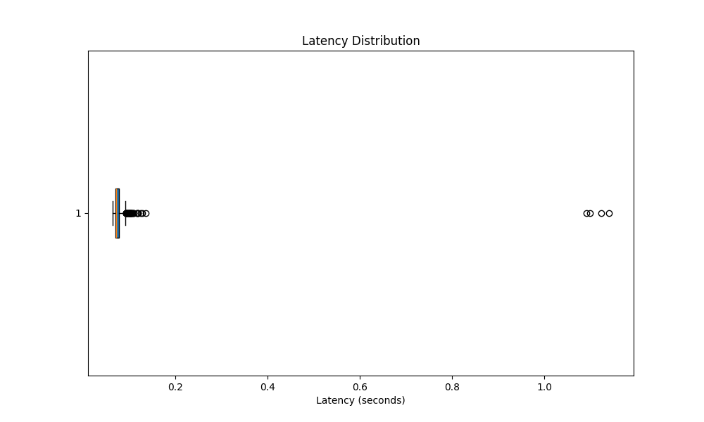

# Sentiment Analysis ML Model Deployed on AWS Elastic Beanstalk

This project demonstrates a machine learning model for sentiment analysis deployed on an AWS Elastic Beanstalk instance. The model predicts whether a given text input has a positive or negative sentiment.

## Performance Analysis

We conducted performance tests on the deployed model to analyze its latency. The results are visualized below:



This box plot shows the distribution of latency across different test cases. Each box represents a different input text, displaying the median, quartiles, and any outliers in the response times.


This bar chart illustrates the average latency for each test case, providing a clear comparison of response times across different input texts.

## Key Findings

- The overall average latency of the model is 0.086137 seconds
- Obama was a US president: 0.085114 seconds
- Donald Trump won the election: 0.086327 seconds
- The Olympic Games are held every 4 years: 0.097206 seconds
- World War III is coming: 0.075900 seconds

These results demonstrate the model's performance characteristics when deployed on AWS Elastic Beanstalk, providing insights into its responsiveness and consistency across various input scenarios.

## Usage

To use the sentiment analysis model, send a POST request to the endpoint with your text input. The model will return a prediction indicating whether the sentiment is positive or negative.

Example:
```python
import requests

response = requests.post('https://your-beanstalk-endpoint.com/predict', json={'text': 'I am very happy today'})
print(response.json())
```
